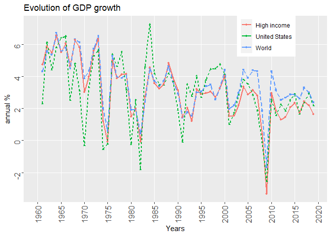
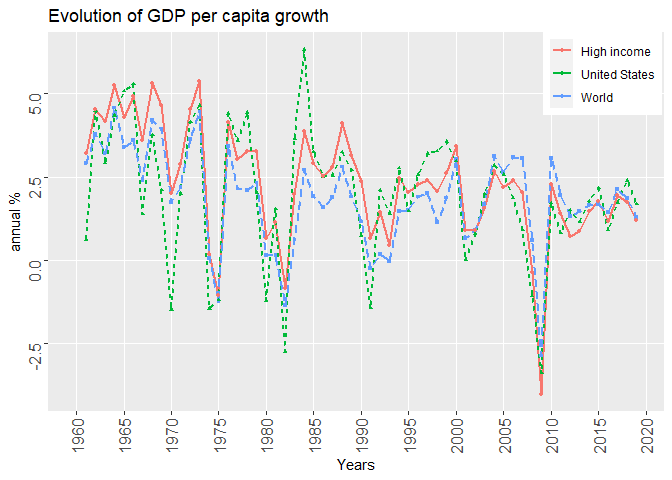

Data from World Bank
================
Juan Camilo Olaya
January 12, 2020

This code[1] will teach you how to use data directly from the [World Bank](https://databank.worldbank.org/home.aspx) locally using an R library for it. It will also show two simple examples of what you can do with this data after having it locally.

### Libraries[2]

The first step is to load the necessary libraries that contain the functions used in this code. If you don't have the libraries, you can install both using the syntax `install.packages(c("tidyverse", "WDI"))`.

``` r
library("tidyverse")
```

    ## -- Attaching packages ------------------------------------------ tidyverse 1.3.0 --

    ## v ggplot2 3.3.0     v purrr   0.3.3
    ## v tibble  2.1.3     v dplyr   0.8.4
    ## v tidyr   1.0.2     v stringr 1.4.0
    ## v readr   1.3.1     v forcats 0.4.0

    ## -- Conflicts --------------------------------------------- tidyverse_conflicts() --
    ## x dplyr::filter() masks stats::filter()
    ## x dplyr::lag()    masks stats::lag()

``` r
library("WDI")
```

### Collection and manipulating the data[3]

Using the function WDI, the data appers in the Environment ready to use with a couple of modifications: to select the data that we need and change the column names to simplying.

This function has the next arguments:

-   **Indicator**: Indicator (data needed) code.
-   **Country**: The countries for which the data is needed.
-   **Start**: Start date.
-   **End**: End date.

In this case GDP annual growth and GDP per capita annual growth are selected from 1960 and 2019. The countries are United States, high income countries, and the world.

``` r
data <- WDI(indicator = c('NY.GDP.MKTP.KD.ZG','NY.GDP.PCAP.KD.ZG'),
            country = c("USA","WLD","HIC"), start = 1960, end = 2019) %>%
  select(year, country, "NY.GDP.MKTP.KD.ZG","NY.GDP.PCAP.KD.ZG")

colnames(data) <- c("year","country","GDP","GDPpc")
```

### Some descriptive statistics

An important part is to understand the selected data. For that reason, we can make some descriptive statistics as mean and standard deviation per each country. So, these lines group the data by country and calculate both measures. You can include more measures such as median, kurtosis and so on.

``` r
print(data %>%
        group_by(country) %>%
        dplyr::summarise(m = mean(GDP, na.rm = TRUE),
                         sd = sd(GDP, na.rm = TRUE)))
```

    ## # A tibble: 3 x 3
    ##   country           m    sd
    ##   <chr>         <dbl> <dbl>
    ## 1 High income    3.09  1.84
    ## 2 United States  3.03  2.05
    ## 3 World          3.48  1.59

``` r
print(data %>% 
        group_by(country) %>% 
        dplyr::summarise(m = mean(GDPpc, na.rm = TRUE),
                         sd = sd(GDPpc, na.rm = TRUE)))
```

    ## # A tibble: 3 x 3
    ##   country           m    sd
    ##   <chr>         <dbl> <dbl>
    ## 1 High income    2.28  1.72
    ## 2 United States  2.00  1.98
    ## 3 World          1.86  1.45

### Plots

Another thing that you can do with the data is visualize it. In this case, two time series plots with each variables and compering the three countries selected.

``` r
p1 <- ggplot(data, aes(year, GDP, group = country, colour = country)) +
  geom_line(aes(linetype = country), size = 1) +
  geom_point(aes(shape = country), size = 1) +
  xlab('Years') +
  ylab('annual %') +
  ggtitle('Evolution of GDP growth') +
  labs(color = "", group = NULL) +
  theme(legend.position = c(0.8, 1.08),
        axis.text.x = element_text(angle = 90, vjust = 0.5, size = 12),
        axis.text.y = element_text(angle = 90, vjust = 0.5, size = 12),
        panel.grid.minor = element_blank(),
        legend.text = element_text(size = 9)
  ) + 
  scale_x_continuous(breaks = seq(1960, 2020, by = 5))

p1
```

    ## Warning: Removed 3 row(s) containing missing values (geom_path).

    ## Warning: Removed 3 rows containing missing values (geom_point).



``` r
p2 <- ggplot(data, aes(year, GDPpc, group = country, color = country)) +
  geom_line(aes(linetype = country), size = 1) +
  geom_point(aes(shape = country), size = 1) +
  xlab('Years') +
  ylab('annual %') +
  ggtitle('Evolution of GDP per capita growth') +
  labs(color = "", group = NULL) +
  theme(legend.position = c(0.9, 1.08),
        axis.text.x = element_text(angle = 90, vjust = 0.5, size = 12),
        axis.text.y = element_text(angle = 90, vjust = 0.5, size = 12),
        panel.grid.minor = element_blank(),
        legend.text = element_text(size = 9)
  ) + 
  scale_x_continuous(breaks = seq(1960, 2020, by = 5))

p2
```

    ## Warning: Removed 3 row(s) containing missing values (geom_path).

    ## Warning: Removed 3 rows containing missing values (geom_point).



### Export the plots and the data

Now, you can save the plots (PDF), and the data (CSV) in your computer.

``` r
pdf(file = "../Plots/GDP.pdf")
p1
```

    ## Warning: Removed 3 row(s) containing missing values (geom_path).

    ## Warning: Removed 3 rows containing missing values (geom_point).

``` r
dev.off()
```

    ## png 
    ##   2

``` r
pdf(file = "../Plots/GDPpc.pdf")
p2
```

    ## Warning: Removed 3 row(s) containing missing values (geom_path).

    ## Warning: Removed 3 rows containing missing values (geom_point).

``` r
dev.off()
```

    ## png 
    ##   2

``` r
write.csv(data, file = "../Outputs/data.csv")
```

### Notes

[1] In this code you need to know about topics related to basic statistical measurements and plot creation.

[2] **Packages information**: [tidyverse](https://www.tidyverse.org/) and [WDI](https://cran.r-project.org/web/packages/WDI/WDI.pdf).

[3] Occasionally, the World Bank API has sporadic issues that affect others libraries which use the connection with this organization. However, the problems are solved. More information about it in the next links: <https://github.com/vincentarelbundock/WDI/issues/35> and <https://github.com/nset-ornl/wbstats/issues/23>
